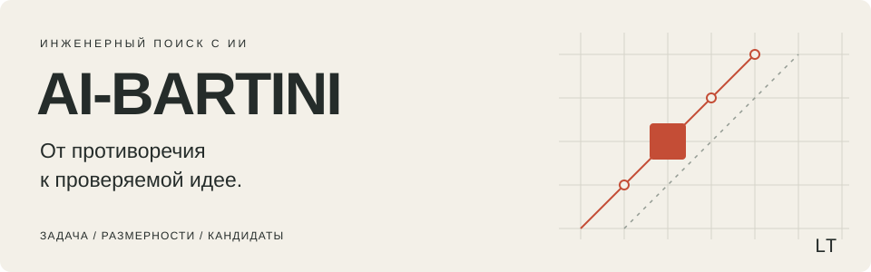

<p align="center">
  
</p>

<p align="center">
  <a href="#попробовать">Попробовать</a> ·
  <a href="READ2PLAY.md">Инструкция агенту</a> ·
  <a href="#пример">Пример</a> ·
  <a href="#справка">Справка</a>
</p>

# AI-Bartini

**Набор инструкций для ИИ, который помогает искать способы разрешения инженерных
противоречий.** Например: деталь должна быть лёгкой, но жёсткой; поверхность —
горячей для обработки, но холодной для сохранности содержимого.

Агент рассматривает измеримые свойства — длину, время, силу, расход, теплообмен —
и использует LT-метод Бушуева–Бартини–Кузнецова для поиска возможных воздействий.
На выходе — кандидаты решений, объяснение их связи с задачей и способы проверки.

Это скилл: текстовые инструкции и справочные материалы, а не самостоятельная
программа или численный решатель. Для начала нужен ИИ-агент с доступом к файлам
репозитория. Учить таблицу Бартини перед первым запуском не требуется.

> **Граница метода.** Совпадение размерностей помогает искать кандидатов, но не
> доказывает, что конструкция будет работать. Расчёт параметров и испытание
> механизма — отдельная работа.

## Попробовать

**1. Дай агенту файлы.** Клонируй репозиторий и открой его папку в агентной среде:

```sh
git clone https://github.com/waldfalke/AI-Bartini.git
cd AI-Bartini
```

Либо скачай ZIP через **Code → Download ZIP**, распакуй и открой папку.
Для текстового разбора не нужны Python, установка пакетов или запуск скриптов.
Явная инструкция ниже не зависит от автоматического обнаружения скиллов.

**2. Скопируй поручение и впиши свою задачу:**

```text
Прочитай READ2PLAY.md в корне этого репозитория и выполни обычный LT-проход.
Объяви запуск метода, затем работай над моей задачей, а не пересказывай инструкции.

Задача: [что нужно получить и что сейчас мешает].
Ограничения и известные данные: [что нельзя менять; размеры, нагрузки,
материалы или другие данные, если они есть].

Отдели данные от допущений. Покажи возможные механизмы, основания их выбора
и ближайшую проверку. Experimental пока не включай.
```

Если агент читает только веб-страницы, дай ему
[ссылку на READ2PLAY.md](https://github.com/waldfalke/AI-Bartini/blob/main/READ2PLAY.md)
и свою задачу. Он должен прочитать и указанные там файлы. Если это невозможно,
передай распакованный репозиторий: одного текста README недостаточно.

**3. Оцени результат.** Ответ должен объяснять, что предлагается изменить и почему
это может помочь. В нём видны исходное противоречие, выбранные величины,
размерные переходы, кандидаты и остающиеся вопросы. Пересказ README не считается
применением метода.

## Пример

**Запаять ампулу и не перегреть содержимое.** Учебный пример из материалов
Бушуева, не новая экспериментальная проверка проекта.

| Задача | Ход поиска | Кандидат и проверка |
|---|---|---|
| Сильное пламя запаивает стекло, но перегревает лекарство. Слабое бережёт лекарство, но мешает запайке. | В разборе появляется «объёмный расход»: искать можно не только другой нагрев, но и организованный поток. | Охлаждать нижнюю часть ампулы проточной водой, сохраняя нагрев у места запайки. Проверить температуру содержимого и качество шва. |

**Из размерности получается расход, а не слово «вода».** Носитель и способ его
применения выбираются по физике задачи.
[Полный разбор с размерными переходами](.claude/skills/lt-bartini-method/examples/ampoules.md).

## Что означает LT

`L` — длина, `T` — время. Скорость записывается как `L/T`, объёмный расход — как
`L³/T`. В принятой авторами системе другие величины тоже сопоставляются выражениям
`LᵐTⁿ`. Таблица и правила перехода помогают искать связанные физические воздействия.
Перевод в LT не заменяет проверку единиц СИ и физических законов.

«Икс-элемент» в материалах — искомое средство или воздействие, способное помочь
с противоречием. «Тренд» — направление переходов по таблице, а не прогноз рынка.

## Experimental: куб и тор

Исследовательская надстройка: **куб обозначает операции над размерностями,
тор — способ показывать их на карте с сохранением полного адреса**. Это не готовый
3D-интерфейс и не доказанное улучшение основного метода.

Для явного запуска используй отдельное поручение:

```text
Прочитай READ2PLAY.md. Запусти lt-bartini-method, experimental: пара куб–тор.
Задача: [моя задача]. Начни с текстового прогона, без создания интерфейса.
```

[Инструкция режима](.claude/skills/lt-bartini-method/experimental/cube-torus.md).

## Справка

| Что нужно | Куда идти |
|---|---|
| Применить метод к своей задаче | [READ2PLAY.md](READ2PLAY.md) |
| Прочитать сам метод | [SKILL.md](.claude/skills/lt-bartini-method/SKILL.md) |
| Посмотреть другие разборы | [Примеры](.claude/skills/lt-bartini-method/examples/) |
| Разобраться в типичных ошибках | [Антипаттерны](.claude/skills/lt-bartini-method/antipatterns.md) |
| Понять границы выводов | [Ограничения](.claude/skills/lt-bartini-method/limits.md) |
| Читать первоисточники | [Работы Бушуева и места в текстах](SOURCES.md) |

Перенос метода на организацию, деньги или смысл рассматривается как **аналогия
или гипотеза**, не как доказательство через физику. Учебные примеры показывают
ход поиска, а не подтверждают пригодность решения для конкретной установки.

## Происхождение

Основой стали статьи А. Б. Бушуева «Математика, ТРИЗ, Бартини и кое-что ещё…»
(2007–2008), опирающиеся на работы Р. О. Бартини и П. Г. Кузнецова.
Ссылки на оригинальные публикации и нужные разделы собраны в [SOURCES.md](SOURCES.md).

Инструкции для ИИ, экспериментальная пара куб–тор и цифровые пробы — работа этого
проекта. Они не приписываются авторам исторического метода.
