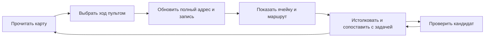

# Гипотеза: карта и пульт LT-метода работают в паре

Дата: 2026-09-08. Статус: исследовательская гипотеза совместной работы.
[Первый текстовый прогон](trial-lt-pair-multicolor-concrete-20260908.md) выполнен
2026-09-08. Сравнение с отдельными представлениями и предметные опыты ещё не проведены.

## Предположение и назначение

Куб операций и тор трендов могут образовать единый инструмент исследования:
куб помогает выбрать преобразование, а тор показывает достигнутую ячейку,
соседние возможности и пройденный маршрут. Прочтение карты задаёт основание для
следующего хода пульта.

Проверяемое предположение: эта обратная связь помогает исследователю выбирать
содержательные ходы, удерживать несколько направлений поиска и возвращаться к
их основаниям лучше, чем каждый объект по отдельности.

Общий принцип: представление доступных действий и представление пространства
состояний могут взаимно направлять исследование, если они опираются на одно полное
состояние, а результат каждого действия доступен для прочтения и оценки.

Краткая формула пары: карта помогает увидеть, куда пойти; пульт задаёт ход;
карта раскрывает результат; исследователь связывает его с предметом задачи.
Кубическая и тороидальная формы — отдельные гипотезы о способе воплощения этого
принципа. Саму совместную работу можно сначала проверить текстом или на бумаге.

## Роли и граница между ними

| Участник | Что делает | Что передаёт дальше |
|---|---|---|
| Исследователь или агент | выбирает измеряемые факторы, истолковывает величины, оценивает кандидатов | постановку, смысл хода, решение о продолжении |
| Куб — пульт | предлагает шесть направленных LT-операций | выбранный оператор |
| Общее состояние | принимает оператор и обновляет полный адрес | новые m,n и запись перехода |
| Тор — карта | отображает адрес, тренд, швы и доступные физические чтения | материал для следующего выбора |

Алгебра граней определена в [документе куба](hypothesis-lt-cube.md).
Кодирование карты и память оборотов определены в [документе тора](hypothesis-lt-torus.md).
Этот документ описывает их совместную работу и её проверку.

## Одно состояние, два представления

Полный адрес (m,n) принадлежит общей рабочей записи. Из него вычисляются S=m+n,
координаты (u,s), видимая позиция тора и счётчики оборотов для выбранных P,Q.
Куб и тор не ведут независимые изменяемые копии адреса. При смене периодов карты
пересчитывается только отображение; физическая размерность остаётся прежней.

Вместе с адресом сохраняются исходное противоречие, выбранные факторы и правила
перевода, рассматриваемая физическая величина, гипотеза механизма и результат её
проверки. Для каждого содержательного перехода достаточно записи:

> Исходный адрес и смысл → оператор → новый адрес → возможное физическое чтение
> → связь с требованием задачи → следующая проверка или открытый вопрос.

Одинаковый адрес может иметь несколько чтений. Поэтому совпадение координат не
сливает автоматически разные гипотезы и не заменяет историю их возникновения.

Операции метода над факторами, включая получение исходного произведения, также
обновляют общую запись. Шесть граней представляют локальные переходы по таблице;
они не заменяют формулировку противоречия и выбор факторов.

## Цикл работы

Движение по карте само по себе не требует признавать каждый посещённый адрес
перспективным. Исследователь может просмотреть окрестность, отложить чтение,
вернуться к развилке или закончить ветвь с указанием причины. Журнал хранит
содержательные решения; повороты камеры и другие движения обзора в него не входят.

Поворот куба и обзор тора меняют представление. Применение грани меняет LT-адрес.
Выбор ранее сохранённой ветви восстанавливает её адрес и контекст и отмечается
как возврат к ветви. Обратная LT-операция восстанавливает координаты, но не стирает
уже сделанные наблюдения.

Так замыкается обратная связь: физическое чтение ячейки может подсказать следующий
оператор, показать необходимость другого входного свойства или дать основание
для внешней проверки. Одна лишь геометрическая близость такого основания не даёт.

## Пример: пульт пересекает шов карты

Пример иллюстрирует согласованную адресацию и не является решением инженерной задачи.
Пусть периоды карты P=Q=6. Начальная величина — давление L²T⁻⁴.

| Момент | Полный адрес (m,n) | Тренд S | Позиция (a,b) | Обороты (i,j) | Чтение карты |
|---|---|---|---|---|---|
| Исходное состояние | (2,−4) | −2 | (2,4) | (0,−1) | давление |
| После L+ | (3,−4) | −1 | (3,5) | (0,−1) | поверхностное натяжение или жёсткость |
| После T+ | (3,−3) | 0 | (3,0) | (0,0) | массовый расход |

Куб задаёт второй ход T+. Карта показывает переход через шов b=5→0 и изменение
счётчика j=−1→0. Полная размерность изменяется ровно на множитель T. Ни шов,
ни новый физический ярлык не доказывают существование механизма, переводящего
давление в массовый расход: это отдельный вопрос исследователя.

## Контрпример: одинаковое место, разные ветви

В одной ветви адрес L³T⁻⁴ прочитан как поверхностное натяжение, в другой — как
жёсткость. Если карта объединит записи по одним координатам, пропадут различия
в механизмах, требованиях и проверках. Пара должна позволять вернуться к каждой
интерпретации с её контекстом. Точный LT-адрес необходим, но недостаточен для
идентификации исследовательской ветви.

## Первая проба с явным запуском скилла

Для первой пробы подходит [задача многоцветного бетона](cold-test-task.md): она
требует одновременно сохранять объёмный рисунок, прочность монолита и качество
поверхности. Это выбранный пример для наблюдения работы пары, а не часть её
определения. Задача уже обсуждалась, поэтому такой прогон не будет независимой
проверкой на неизвестном случае.

Предлагаемый текст отдельного запуска:

> Примени `$lt-bartini-method` к задаче из `D:/Dev/AI-Bartini/cold-test-task.md`.
> Прочитай действующий скилл и его необходимые материалы. Дополнительно прочитай
> `D:/Dev/AI-Bartini/hypothesis-lt-cube.md`,
> `D:/Dev/AI-Bartini/hypothesis-lt-torus.md` и
> `D:/Dev/AI-Bartini/hypothesis-lt-pair.md`.
> Используй куб как пульт операций, тор как карту, а полный адрес и контекст
> задачи храни в общей записи. Для каждого содержательного хода покажи оператор,
> изменение адреса, физическую интерпретацию и способ проверки. Пройди все
> выделенные противоречия, сохраняя нерешённые вопросы. Различай формальный переход
> и физическое обоснование. Укажи, где пара изменила поиск, где только его оформление
> и где затруднила работу. Начни с текстового прогона без изготовления интерфейса.

Первый запуск по этой постановке описан в
[отчёте о многоцветном бетоне](trial-lt-pair-multicolor-concrete-20260908.md).
В первом прогоне установленные файлы скилла не изменялись; пара подключалась явно.
Теперь инструкция включена в скилл как opt-in раздел
[experimental/cube-torus.md](.claude/skills/lt-bartini-method/experimental/cube-torus.md).
Короткий запуск: `$lt-bartini-method experimental: пара куб–тор; задача: …`.
Обычный режим LT остаётся прежним; три гипотезы и отчёт сохраняются отдельно.

## Как различить вклад пары и вклад её частей

Операционная проверка должна показать согласованность каждого хода куба с картой,
сохранение полного адреса на швах и восстановление контекста при возврате к ветви.
Её можно провести на коротких заранее вычисленных маршрутах.

Для проверки совместной пользы сопоставляются четыре режима: обычный LT-метод;
куб с обычной таблицей; тор с обычным выбором операций; куб и тор вместе.
Задачи и доступные сведения должны быть сопоставимы, а порядок меняется, чтобы
знакомство с ответом не принималось за эффект инструмента.

Наблюдаются ошибки адресации, потерянные ветви, усилие возврата к основаниям хода,
а также физически обоснованные кандидаты и результаты их проверки. Самоотчёт агента
о том, что карта «помогла», сопоставляется с фактическим маршрутом исследования.

Совместная гипотеза получает поддержку, если связь между картой и пультом помогает
по наблюдаемым признакам больше, чем отдельные представления, с учётом времени и
усилий. Если весь выигрыш даёт один компонент, польза второго остаётся неподтверждённой.
Если связка помогает в текстовом виде, это поддерживает принцип совместной работы,
но ещё не устанавливает преимущество трёхмерных форм.

## Происхождение и открытое продолжение

Первое наблюдение: запись позволила выполнить 23 элементарных перехода и сохранить
разные физические чтения одинаковых ячеек. В ходе разбора обнаружена потеря
безразмерного множителя в интерпретации при правильном LT-адресе; ошибка и её
исправление сохранены в журнале отчёта. Полные множители и предметный контекст
нужны наряду с координатами. Преимущество пары и объёмных форм ещё не установлено.

Пара предложена в обсуждении проекта 2026-09-08 на основе гипотез
[куба](hypothesis-lt-cube.md) и [тора](hypothesis-lt-torus.md).
Её главный открытый вопрос: становится ли переход «увидеть → преобразовать →
прочитать заново» продуктивнее благодаря двум согласованным представлениям?
Ответ должен появиться из наблюдаемой работы с задачами.
